 

 

---

## How I got here

I did not start with security. I started with a plant in Golestan that could not afford to
have its systems go down, and a job keeping them up through the construction and
commissioning of an iodine extraction facility. Two years of that teaches you something a
course cannot: that the interesting failures are never the ones in the design document, and
that "it works on my machine" is a sentence with real consequences when the machine is in a
control room.

Then I started building software for environments where the network is not a given, and
found the same lesson waiting. So I stopped treating isolation as a constraint to work
around and started treating it as the thing worth building.

---

## The range

Most of what I do sits at the seams. Not the frontend, not the backend — the awkward joints
where a TPM chip has to convince a database that a license is valid, or where a Flutter
client has to find an appliance on a network with no DNS and no internet.

I do not claim equal depth at every layer. I claim I can move between them without needing
someone to translate, which on a small team is the thing that actually matters.

---

## How I work

**I optimise for the failure case.** The happy path is the easy half. Most of the design
work in Vault-OS went into what happens when the install loses power at 18GB, when the
measurement doesn't match, when the operator loses the password. Shutdown *verifies* the
enclave locked rather than assuming it — because assuming is how you find out six months
later.

**I remove dependencies rather than manage them.** Every layer you add is a layer that can
fail, be compromised, or be discontinued by someone else's business decision. Vault-OS runs
PostgreSQL natively instead of in a container, not because containers are bad, but because
a container runtime is one more thing between me and a guarantee I have to make in writing.

**I prefer claims that can be falsified.** "Military-grade" means nothing. "SHA-256
hash-chained, RSA-signed, and here is the ledger" either verifies or it doesn't. When I
write a number in a spec I want it to be checkable, and when I can't check it I'd rather
not write it.

**I build for the operator, not the demo.** Nine clearance tiers and server-enforced
auto-delete are unglamorous. They are also what someone actually needs at 2am when a
contractor's access has to be revoked before the audit.

**I read the standard.** NIST SP 800-88 exists, is specific about what erasure means, and
is more useful than any blog post about secure deletion. Most of the hard problems have
been thought about carefully by someone else first.

---

## What the biomedical degree is actually for

People assume it's unrelated. It isn't, and not for the reason you'd guess.

Biomedical engineering is the discipline of building things that fail safely around people
who cannot consent to the risk — where the regulatory burden is the engineering, not
paperwork stapled to it afterwards. That is the same instinct behind an air-gapped
appliance for a hospital or a defence contractor. Signal processing, control systems and the
statistics of measurement all transfer directly. The habit of treating a compliance regime
as a design input transfers even more.

It also keeps me honest about the AI hype. When you've studied how hard it is to validate a
medical device, you become suspicious of anything that claims to work because it demoed
well.

---

## Building

<table>
<tr><td width="50%" valign="top">

### Vault-OS · IronGap
Air-gapped AI appliance. `v1.0.9.1`, Windows shipping.

`TPM 2.0` `pgvector` `vLLM` `TensorRT-LLM` `Node.js`

Hardware-tethered licensing, zero-Docker native services, DAG agent runtime, hash-chained
audit ledger, NIST SP 800-88 burn protocol.

**[Architecture →](https://github.com/IronGap-Technologies)**

</td><td width="50%" valign="top">

### Vault-Ecosystem
Companion clients for the appliance.

`Flutter` `Dart` `Riverpod`

Biometric-locked founder and staff consoles, an offline TOTP authenticator, and hotspot
auto-discovery so devices find the appliance inside an isolated perimeter.

</td></tr>
<tr><td width="50%" valign="top">

### [TRACES](https://github.com/taha-halakoo/Lumo-traces)
Content pinned to physical coordinates, locked until you're within 20 m.

`Fastify` `PostGIS` `pgvector` `Flutter`

Hybrid vector + spatial ranking, offline-first client, realtime sync, Turborepo monorepo.
The proximity constraint is enforced server-side — the client is never trusted with it.

</td><td width="50%" valign="top">

### [StudyHub OS](https://github.com/taha-halakoo/studyhub)
Modular productivity dashboard with an AI assistant.

`React` `TypeScript` `Supabase` `Zustand`

Lazy-loaded feature modules, RBAC over Supabase Auth, realtime collaboration.

</td></tr>
<tr><td width="50%" valign="top">

### [Virtual Mouse](https://github.com/taha-halakoo/virtual-mouse)
Hands-free pointer control from hand tracking.

`Python` `MediaPipe` `OpenCV`

One-Euro filtering with relative delta tracking. A clutch gesture lets you reposition your
arm without moving the cursor — the detail that makes it usable rather than a demo.

</td><td width="50%" valign="top">

### YTU BME Nexus
Department platform for Biomedical Engineering at Yıldız Technical.

`React` `Supabase`

Built for the department I actually study in, which is a useful constraint — the users find
me in the corridor.

</td></tr>
</table>

---

## Currently

Getting Vault-OS onto Linux and macOS. Reading more about formal verification than I can
yet apply. Learning where the limits of local inference actually are, as opposed to where
the benchmarks say they are.

Open to conversations about sovereign AI infrastructure, secure systems, and anything at
the seam between hardware and software.

Generated daily by <a href="scripts/gen_stats.py">a script in this repo</a> rather than a third-party widget —
the usual ones rate-limit, run out of quota, and eventually stop rendering.
Fitting, for someone who builds things that don't phone home.

---

Founder & Chief Architect at **[IronGap Technologies](https://www.iron-gap.com)** · Istanbul, Türkiye
Biomedical Engineering at **Yıldız Technical University** · MATE R&D, Polaris Group

[iron-gap.com](https://www.iron-gap.com) · [LinkedIn](https://www.linkedin.com/in/taha-halakooei) · [taha@iron-gap.com](mailto:taha@iron-gap.com)

 

<i>Isolation you can verify beats assurance you have to trust.</i>

